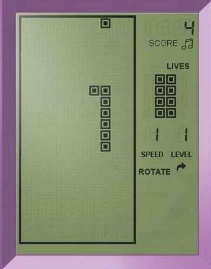
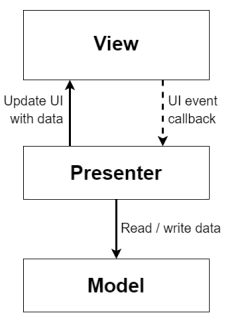

# BrickGame Iloncha
Qisqa mazmuni: ushbu loyihada siz obyektga yo'naltirilgan dasturlash paradigmasida C++ dasturlash tilida "Iloncha" o'yinini amalga oshirasiz.

💡 **Ushbu loyiha haqida biz bilan fikr-mulohazalaringizni baham ko’rish uchun [bu yerni bosing](https://new.oprosso.net/p/4cb31ec3f47a4596bc758ea1861fb624).** Bu anonim bo’lib, jamoamizga ta’limni yaxshilashga yordam beradi. Loyihani tugatgandan so'ng darhol so'rovnomani to'ldirishni tavsiya qilamiz.

## Mundarija

  - [Kirish](#kirish)
  - [Chapter I](#chapter-i)
  - [Umumiy ma'lumot](#umumiy-malumot)
    - [Iloncha](#iloncha)
    - [MVC patterni](#mvc-patterni)
    - [MVP patterni](#mvp-patterni)
    - [MVVM patterni](#mvvm-patterni)
  - [Chapter II](#chapter-ii)
  - [Loyiha talablari](#loyiha-talablari)
    - [1-qism. Asosiy vazifa](#1-qism-asosiy-vazifa)
    - [2-qism. Qo'shimcha. O'yindagi ochkolarni hisoblash va rekord](#2-qism-qoshimcha-oyindagi-ochkolarni-hisoblash-va-rekord)
    - [3-qism. Qo'shimcha. Darajalar mexanikasi](#3-qism-qoshimcha-darajalar-mexanikasi)

## Kirish

“Iloncha” o'yinini amalga oshirish uchun loyiha ikkita alohida komponentdan iborat: o'yin mantig'ini amalga oshirish uchun mas'ul bo'lgan kutubxona va desktop grafik interfeysi.

Ishlab chiqilgan kutubxona, shuningdek, BrickGame v1.0 dan konsol interfeysiga ulanishi kerak bo'ladi. Konsol interfeysi yangi o'yinni to'liq qo'llab-quvvatlashi kerak.

BrickGame v1.0 da ishlab chiqilgan “Tetris” o'yini ushbu loyihada ishlab chiqilgan desktop interfeysiga ulangan bo'lishi kerak. U o'yinni to'liq qo'llab-quvvatlashi kerak.

## Chapter I 
## Umumiy ma'lumot

Shuni eslatib o'tamizki, o'yin mantig'ini formallashtirish uchun so’nggi avtomatlardan foydalanishingiz kerak. Bilimingizni yangilash uchun KAning tavsiflari va misollarini [bu yerda](materials/brick-game-v1.0_RUS.md) topishingiz mumkin.

### Iloncha

O'yinchi uzluksiz ravishda oldinga harakatlanuvchi ilonchani boshqaradi. O'yinchi strelkalar yordamida ilonning harakat yo'nalishini o'zgartiradi. O'yinning maqsadi o'yin maydonida paydo bo'lgan "olmalar" ni yig'ishdir. Bunda, o'yinchi o'yin maydonining devorlariga tegmasligi kerak. Keyingi "olma" ni "yeyish" dan so'ng, ilonning uzunligi bir martaga ortadi. Agar ilon maksimal o'lchamga (200 "piksel") erishsa, o'yinchi g'alaba qozonadi. Agar iloncha o'yin maydonining chegarasi bilan to'qnashsa, o'yinchi yutqazadi.

O'yin Blockage deb nomlangan boshqa o'yin asosida ishlab chiqilgan. Unda ikkita o'yinchi yorib kirib bo'lmaydigan iz qoldirgan personajlarni boshqaradi. Eng uzoq davom etgan o'yinchi g'alaba qozonardi. 1977 yilda Atari faqat bitta o'yinchi o'ynaydigan Worm o'yinini chiqardi. O'yinning eng mashhur versiyasini shved kompaniyasi Nokia tomonidan Nokia 6110 telefoni uchun chiqarilgan va Taneli Armanto tomonidan ishlab chiqilgan 1997 yilgi versiya deb hisoblash mumkin.

### MVC patterni

MVC patterni (Model-View-Controller, Model-Ko’rinish-Kontroller) ilova modullarini uchta alohida makrokomponentga bo'lish sxemasi demakdir: biznes mantig'ini o'z ichiga olgan model, ko'rinish – dastur bilan o'zaro ishlash uchun foydalanuvchi interfeysi shakli va foydalanuvchi harakati asosida model modifikatsiyasini amalga oshiradigan kontroller.

MVC konsepsiyasi 1978 yilda “Xerox PARC” ilmiy-tadqiqot markazida “Smalltalk” dasturlash tili bo'yicha ishlagan Tryugve Reyenskaug tomonidan tavsiflangan. Keyinchalik Stiv Burbek shablonni Smalltalk-80 da amalga oshirdi. MVC konsepsiyasining yakuniy versiyasi faqat 1988 yilda Technology Object jurnalida nashr etilgan. Keyinchalik, loyihalash shablonlari rivojlana boshladi. Masalan, HMVC, MVA va MVVM ning ierarxik versiyasi taqdim etildi.

Ushbu pattern paydo bo'lishining asosiy zarurati ishlab chiquvchilarning dasturning biznes mantig’ini ko'rinishlardan ajratish istagi bilan bog'liq bo'lib, bu ko'rinishlarni almashtirishni va boshqa shartlarda bir marta amalga oshirilgan mantiqni qayta ishlatishni osonlashtiradi. Ko'rinishidan ajratilgan holda, model va u bilan ishlash uchun kontroller allaqachon yozilgan kodni samarali qayta ishlatish yoki o'zgartirish imkonini beradi.

Model asosiy ma'lumotlarni saqlaydi va unga kirishni amalga oshiradi, dasturning biznes mantig'i bilan belgilanadigan so'rovlar bo'yicha operatsiyalarni bajaradi, ya'ni dasturning barcha algoritmlar va ma'lumotlarni qayta ishlash jarayonlari uchun javob beradigan qismini boshqaradi. Model ma'lumotlari, kontroller tomonidan o'zgartirilganda, foydalanuvchi interfeysi ko'rinishidagi ma'lumotlarning aks ettirilishiga ta'sir qiladi. Ushbu dasturdagi model sifatida iloncha o'yini mantig’ini amalga oshiradigan sinf kutubxonasi bo'lishi kerak. Ushbu kutubxona o'yin mexanikasini amalga oshirish uchun barcha kerakli sinflar va usullarni taqdim etishi kerak. Bu ushbu dasturning biznes mantig'i, chunki u muammoni hal qilish vositalarini taqdim etadi.

Kontroller – model modifikatsiyasini amalga oshiradigan nozik makrokomponentdir. Modelni o'zgartirish bo'yicha so'rovlar u orqali yaratiladi. Kodda bu model uchun o'ziga xos "fasad", ya'ni model bilan bevosita ishlaydigan usullar to'plamidek ko’rinadi. U nozik deb ataladi, chunki ideal kontroller bir yoki bir nechta model usullarini chaqirishdan tashqari hech qanday qo'shimcha mantiqni o'z ichiga olmaydi. Kontroller interfeys va model o'rtasidagi bog'lovchi element funksiyasini bajaradi. Bu modelni tasvirdan to'liq inkapsulalash imkonini beradi. Bunday ajratish foydalidir, chunki u taqdim etish kodiga model kodi haqida hech narsa bilmaslikka imkon beradi va faqat bitta kontrollerga murojaat qilishga imkon beradi, taqdim etilgan funksiyalarning interfeysi, ehtimol, sezilarli darajada o'zgarmaydi. Model sezilarli o'zgarishlarga duch kelishi mumkin va modeldagi boshqa algoritmlarga, texnologiyalarga yoki hatto dasturlash tillariga "o'tishda" to'g'ridan-to'g'ri modelga tegishli kontrollerdagi kodning faqat kichik qismini o'zgartirish talab qilinadi. Aks holda, ehtimol, interfeys kodining muhim qismi qayta yozilishiga to’g’ri kelgan bo’lardi, chunki u modelni amalga oshirishga juda bog'liq bo’lgan bo’lardi. Shunday qilib, interfeys bilan o'zaro aloqada bo'lgan holda, foydalanuvchi modelni modifikatsiyalovchi kontroller usullarini chaqiradi.

Ko'rinish dastur interfeysi bilan bog'liq barcha kodlarni o'z ichiga oladi. Ideal interfeys kodida hech qanday biznes mantig'i bo'lmasligi kerak. U faqat foydalanuvchi bilan o'zaro aloqa qilish uchun shaklni taqdim etadi.

### MVP patterni

MVP patternida MVC bilan umumiy bo'lgan ikkita komponent mavjud: model va ko'rinish. Lekin u kontrollerni prezenter bilan almashtiradi.

Prezenter model va ko'rinish o'rtasidagi o'zaro ta'sirni amalga oshiradi. Ko'rinish prezenterga foydalanuvchi biror narsa qilgani haqida xabar berganida (masalan, tugmani bosgani haqida), prezenter modelni yangilashga qaror qiladi va model va ko'rinish o'rtasidagi barcha o'zgarishlarni sinxronlashtiradi. Biroq, prezenter ko'rinish bilan bevosita muloqot qilmaydi. Buning o'rniga u interfeys orqali muloqot qiladi. Buning yordamida ilovaning barcha komponentlari keyinchalik alohida sinovdan o'tkazilishi mumkin.

### MVVM patterni

MVVM – MVC ning yanada zamonaviy evolyutsiyasidir. MVVM ning asosiy maqsadi – taqdimot va model darajalari o'rtasida aniq ajratishni ta'minlashdir.

MVVM View va ViewModel komponentlari o'rtasida ikki tomonlama ma'lumotlarni ulashni qo'llab-quvvatlaydi.

Ko'rinish ko'rinish modeli (ViewModel) tomonidan taqdim etilgan xususiyatlarning qiymatlarini o'zgartiradigan hodisalar obunachisi bo'ladi. Agar ko'rinish modelida biror xususiyat o'zgargan bo'lsa, u barcha obunachilarni bu haqda xabardor qiladi va ko'rinish, o'z navbatida, ko'rinish modelidan xususiyatning yangilangan qiymatini so'raydi. Agar foydalanuvchi har qanday interfeys elementida harakat qilsa, ko'rinish, ko'rinish modeli tomonidan taqdim etilgan mos keladigan buyruqni chaqiradi.

Ko'rinish modeli, bir tomondan, ko'rinishning abstraksiyasi, boshqa tomondan esa, bog'lanishi kerak bo'lgan modeldagi ma'lumotlarning o'ramidir. Ya'ni, u ko'rinishga aylantirilgan modelni, shuningdek, ko'rinish modelga ta'sir qilish uchun foydalanishi mumkin bo'lgan buyruqlarni o'z ichiga oladi.

## Chapter II 
## Loyiha talablari

### 1-qism. Asosiy vazifa 

BrickGame v2.0 ni amalga oshiring:

- Dastur C++20 standarti C++ tilida ishlab chiqilgan bo'lishi kerak.
- Dastur ikki qismdan iborat bo'lishi kerak: iloncha o'yini mantig'ini amalga oshiradigan kutubxona va desktop interfeysi.
- O'yin mantig'ini formallashtirish uchun so’nggi avtomatdan foydalanish kerak.
- Kutubxona BrickGame ning birinchi qismida berilgan spetsifikatsiyaga mos kelishi kerak (uni materials/library-specification_UZB.md sahifasida topish mumkin).
- Dastur kutubxonasi kodi src/brick_game/snake papkasida joylashgan bo'lishi kerak.
- Dastur interfeysiga ega kod src/gui/desktop papkasida joylashgan bo'lishi kerak.
- Kod yozishda Google Style-ga amal qiling.
- Sinflar `s21` nomli maydoni ichida amalga oshirilishi kerak
- O'yin mantig'ini amalga oshiradigan kutubxona unit testlar bilan qamrab olinishi kerak. KA holati va o'tishlarini tekshirishga alohida e'tibor bering. Testlar uchun GTest kutubxonasidan foydalaning. Kutubxonaning testlar bilan qamrab olinishi kamida 80 foizni tashkil qilishi kerak.
- Dastur GNU dasturlari uchun standart maqsadlar to'plamiga ega Makefile yordamida tuzilishi kerak: all, install, uninstall, clean, dvi, dist, test. O'rnatish boshqa har qanday boshqa ixtiyoriy katalogda amalga oshirilishi kerak.
- Amalga oshirish C++20 uchun API ga ega GUI kutubxonalaridan biriga asoslangan grafik foydalanuvchi interfeysi bilan boʻlishi kerak:
  - Qt 
  - GTK+
- Dastur MVC patterni yordamida amalga oshirilishi kerak, shuningdek:
  - ko'rinish kodida biznes mantiq kodi bo'lmasligi kerak;
  - kontroller va modelda interfeys kodi bo'lmasligi kerak;
  - Kontrollerlar ingichka bo'lishi kerak.
- BrickGame v1.0 loyihasidan o‘yin mantig’iga ega kutubxona papkasini o‘tkazing.
- Desktop interfeysi BrickGame v1.0 loyihasidagi o‘yinni qo‘llab-quvvatlashi kerak.
- BrickGame v1.0 loyihasidan o'yinning konsol interfeysiga ega papkani o'tkazing.
- Konsol interfeysi ilonchani qo'llab-quvvatlashi kerak.
- Iloncha oʻyinida quyidagi mexanikalar boʻlishi kerak:
  - O'yin taymerining muddati tugagandan so'ng, iloncha mustaqil ravishda maydon bo'ylab bir blok oldinga siljishi kerak.
  - Iloncha "olma" bilan to'qnashganda, uning uzunligi birga ortadi.
  - Ilonchaning uzunligi 200 birlikka yetganda, o'yinchi g'alaba qozonishi bilan o'yin tugaydi.
  - Iloncha maydonning chegarasi yoki o'zi bilan to'qnashganda, o'yin o'yinchining mag'lubiyati bilan tugaydi.
  - Foydalanuvchi strelkalar yordamida ilonning harakat yo'nalishini o'zgartirishi mumkin, bunda iloncha joriy harakat yo'nalishiga nisbatan faqat chapga va o'ngga burilishi mumkin.
  - Foydalanuvchi harakat tugmachasini bosib ilonning harakatini tezlashtirishi mumkin.
- Ilonchaning dastlabki uzunligi to'rt "piksel"dir.
- O‘yin maydonining kengligi 10 piksel va balandligi 20 piksel.
- Loyihani topshirish uchun amalga oshirilgan KA uchun barcha holatlar va ular o'rtasidagi o'tishlarni aks ettiruvchi diagrammani tayyorlang.

### 2-qism. Qo'shimcha. O'yindagi ochkolarni hisoblash va rekord

O'yinga quyidagi mexanikani qo'shing:

- ochkolarni hisoblash;
- maksimal ochkolar sonini saqlash.

Ushbu ma'lumot yon paneldagi foydalanuvchi interfeysi tomonidan uzatilishi va ko'rsatilishi kerak. Ochkolarning maksimal soni faylda yoki o'rnatilgan Ma’lumotlar bazasini boshqarish tizimida saqlanishi va dasturni ishga tushirish oralig'ida saqlanishi kerak.

Agar foydalanuvchi o'yin davomida joriy maksimal ochkodan oshib ketgan bo'lsa, o'yin davomida maksimal ochko o'zgarishi kerak.

Ochkolar quyidagicha beriladi: keyingi "olma" yeyilganida, bir ochko qo'shiladi.

### 3-qism. Qo'shimcha. Darajalar mexanikasi

O'yinga darajalar mexanikasini qo'shing. O'yinchi har safar 5 ball to'plaganida, daraja 1 ga oshadi. Darajani oshirish ilonning tezligini oshiradi. Maksimal darajalar soni – 10.
